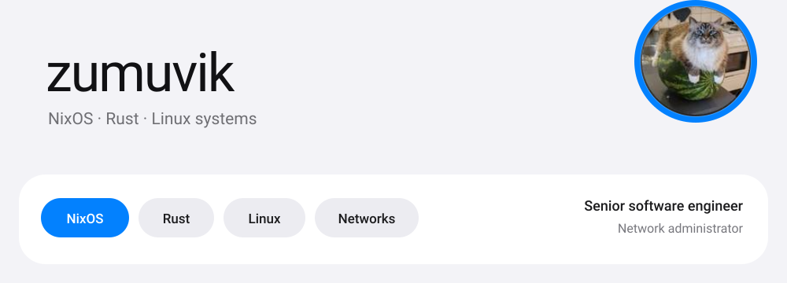
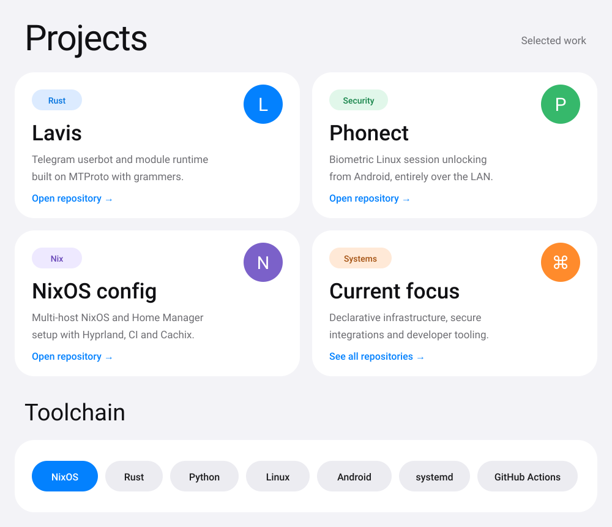

<picture>
  <source media="(prefers-color-scheme: dark)" srcset="./assets/oneui-header-dark.svg" />
  <source media="(prefers-color-scheme: light)" srcset="./assets/oneui-header-light.svg" />
  
</picture>

 

I build reproducible systems and Linux-native tools with a focus on declarative infrastructure, clear architecture and secure defaults.

  

[**Lavis**](https://github.com/zumuvik/lavis)　·　[**Phonect**](https://github.com/zumuvik/phonect)　·　[**NixOS config**](https://github.com/zumuvik/nixos_v2)　·　[**All repositories**](https://github.com/zumuvik?tab=repositories)

 

<picture>
  <source media="(prefers-color-scheme: dark)" srcset="./assets/oneui-dashboard-dark.svg" />
  <source media="(prefers-color-scheme: light)" srcset="./assets/oneui-dashboard-light.svg" />
  
</picture>

 

## GitHub activity

<picture>
  <source media="(prefers-color-scheme: dark)" srcset="https://github-readme-stats.vercel.app/api?username=zumuvik&show_icons=true&hide_border=true&bg_color=1c1c1e&title_color=3e91ff&icon_color=3e91ff&text_color=fafafa&rank_icon=github&border_radius=26" />
  <source media="(prefers-color-scheme: light)" srcset="https://github-readme-stats.vercel.app/api?username=zumuvik&show_icons=true&hide_border=true&bg_color=f3f3f7&title_color=0381fe&icon_color=0381fe&text_color=1c1c1e&rank_icon=github&border_radius=26" />
  
</picture>

<picture>
  <source media="(prefers-color-scheme: dark)" srcset="https://github-readme-stats.vercel.app/api/top-langs/?username=zumuvik&layout=compact&hide_border=true&bg_color=1c1c1e&title_color=3e91ff&text_color=fafafa&exclude_repo=nixpkgs&border_radius=26" />
  <source media="(prefers-color-scheme: light)" srcset="https://github-readme-stats.vercel.app/api/top-langs/?username=zumuvik&layout=compact&hide_border=true&bg_color=f3f3f7&title_color=0381fe&text_color=1c1c1e&exclude_repo=nixpkgs&border_radius=26" />
  
</picture>

  

Reproducibility over snowflake systems. Clear interfaces over hidden magic.

